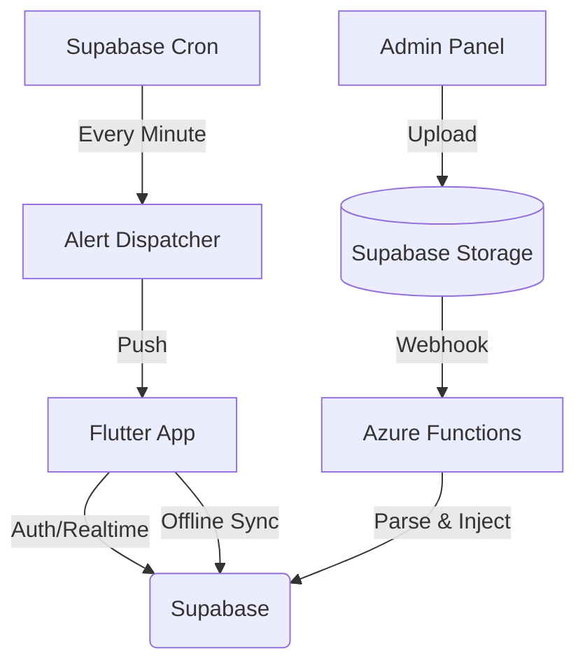

# 🎓 EWUmate: The Ultimate University Companion

EWUmate is a high-performance, intelligent digital assistant designed specifically for students at **East West University**. It streamlines academic life by automating schedule management, notification delivery, and document parsing into a unified, professional mobile experience.

---

## 🏗️ System Architecture

EWUmate uses a distributed "Unified Backend" architecture to ensure maximum reliability and speed.

### 🧠 Core Components:
1.  **Mobile App (Flutter)**: The student-facing interface, featuring a custom glassmorphism UI, offline-first notification logic, and a dynamic schedule manager.
2.  **Supabase (Primary Backend)**:
    *   **PostgreSQL**: Authoritative source for profiles, courses, and schedules.
    *   **Realtime**: Instant sync of notifications and dashboard updates.
    *   **Edge Functions**: Serverless logic for "Alert Scheduling," "Broadcasting," and "Authentication."
    *   **Storage**: Secure hosting for PDFs and student documents.
3.  **Azure Functions (Parsing Brain)**: Scalable Python backend that automatically parses complex PDF catalogs (Faculty lists, Exam schedules, Academic calendars) and structures them for the database.

---

## 🚀 Key Innovation: The "Offline Pulse"

One of EWUmate's most critical features is its ability to deliver reminders without an internet connection.

*   **How it works**: Every time the app starts, it fetches your future `scheduled_alerts` for the next 7 days.
*   **Local Registration**: These alerts are registered with the device's native alarm manager (`flutter_local_notifications`).
*   **Result**: Even if a student is in a basement with zero signal, their phone will still vibrate exactly 10 minutes before class.

---

## 🛠️ Feature Modules

### 📅 Schedule Manager
Sophisticated logic that merges your enrolled courses with the current academic week, handling:
*   Standard weekly classes.
*   Holiday overrides.
*   Ramadan timetable adjustments.
*   Exam day highlights.

### 🗳️ Advising Planner
A powerful tool to help students plan their next semester:
*   **Automated Mode**: Uses an engine to find all non-conflicting combinations based on selected courses.
*   **Manual Mode**: Allows students to hand-pick sections and verify they fit.
*   **Lead-Time Locking**: Controlled by a 7-day governance policy before official advising starts.

### 📂 Automated Ingestion
Admins can update the entire university database in seconds:
1.  Admins upload a new PDF via **[admin.rxxeron.me](https://admin.rxxeron.me)**.
2.  Supabase Storage triggers a webhook to **Azure Functions**.
3.  The parser extracts data and updates the `Spring2026_courses` (or relevant) tables instantly.

---

## 📊 Data Flow & Synchronization

EWUmate maintains a "Split-Model" architecture for academic tracking to balance performance and detail:

*   **Detailed Marks (Semester Progress)**: Stored as a rich JSON object in the `semester_progress` table. This tracks individual quizzes, labs, and attendance.
*   **High-Level Stats (Semester Summary)**: Stored in the `semester_course_stats` table. This is used for fast performance charting and scholarship proximity calculations.
*   **Auto-Sync**: The app features a one-way synchronization layer. Whenever detailed marks are updated, the `SemesterProgressRepository` automatically recalculates the total percentage and updates the high-level stats table, ensuring both screens are always in sync.

---

## ⚙️ Development Highlights

### Technology Stack:
*   **Frontend**: Flutter (Riverpod, GoRouter, Glass Kit)
*   **Backend**: Supabase (PostgreSQL, Edge Functions, Auth, Realtime)
*   **Parsing**: Azure Functions (Python, PyMuPDF)
*   **Automation**: GitHub Actions (CI/CD for Admin Panel and Mobile builds)

### Production Hardening:
*   **Obfuscation**: Native Android code is obfuscated to protect intellectual property.
*   **Governance**: Feature gates (Advising/Grades) are server-authoritative.
*   **Error Handling**: Global `try-catch` in `main_dart` ensures no "silent" white-screen crashes.

---

## 🤝 Contribution & Maintenance

To maintain the project:
1.  **Environment**: Ensure `.env` contains valid `SUPABASE_URL` and `SUPABASE_ANON_KEY`.
2.  **Backend Changes**: Deploy Edge Functions via `supabase functions deploy [name]`.
3.  **Parsers**: Azure triggers are located in the `azure_functions/` directory.

**EWUmate — Built for Excellence.** 🌟🎉🏆